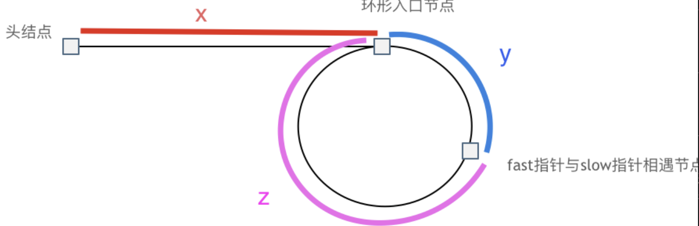

# 链表

## 反转链表

临时将next item存储下来，再穿针引线。

递归法就是先处理，最后return的时候将pre和cur的参数换成cur和next。

## 删除倒数第N个节点

先一个快指针走过N个节点，再快慢两个指针一起走，走到最后慢指针就是要删除的那一个。

## 链表相交

先求出两个链表的长度，然后将两个链表尾部对齐，再比较相同位置上的元素。

## 环形链表

快慢指针，求上图中的x和z的关系。